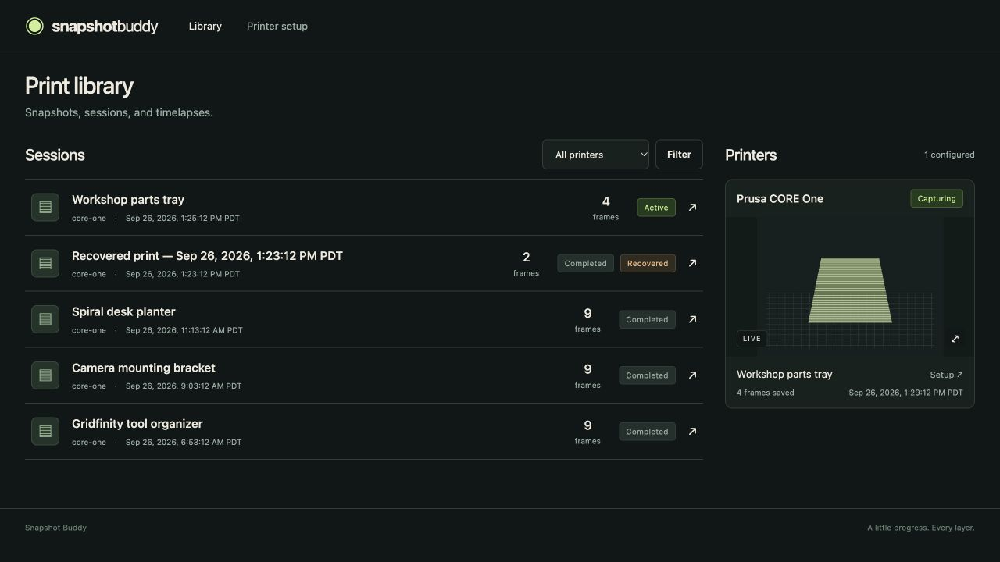
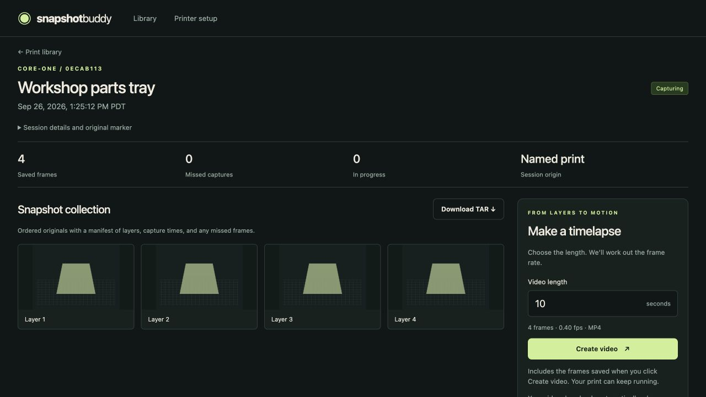

# Snapshot Buddy

A home for your 3D print snapshots. Run Snapshot Buddy beside go2rtc, collect a
frame at each layer, and download the originals or a timelapse of exactly the
length you want.

Snapshot Buddy is a Go service for 64-bit Raspberry Pi and x86 Linux. It uses
your existing go2rtc server and the camera's standard RTSP firmware. Nothing
runs on the camera and no camera SD card is needed.

- Multiple printers and camera streams in one interface.
- Named print sessions, plus automatic recovery when the START marker is lost.
- Session history, live WebRTC previews, capture diagnostics, and manual close.
- TAR archives with JPEG originals and a capture manifest.
- Background H.264 MP4 generation: choose a length and the frame rate is calculated.
- Persistent SQLite metadata, plain image files, and optional Basic authentication.
- YAML configuration, non-root Docker images, and no cloud dependency.





## Quick start

Requirements: a 64-bit Docker host, an existing go2rtc server with FFmpeg
available for JPEG conversion, and a Prusa Buddy-firmware printer capable of
sending its `gcode` metrics. Printer and camera IP addresses should have DHCP
reservations. The web interface is for a trusted LAN, or an authenticated HTTPS
reverse proxy.

1. Enable RTSP in your camera's standard firmware and configure a named stream
   in go2rtc. For example, in **go2rtc's** configuration:

   ```yaml
   streams:
     buddy3d: rtsp://192.168.1.43/live
   ```

   The address above is illustrative: use the RTSP path, port, and credentials
   documented for your camera's standard firmware. Verify that stream in
   go2rtc before starting Snapshot Buddy. Standard-firmware RTSP support is a
   prerequisite, not something this application adds or enables on the camera.

2. Download the Compose and configuration examples from the
   [v1.0.0 source](https://github.com/nebhale/snapshot-buddy/tree/v1.0.0), or clone
   the repository and check out `v1.0.0`. Copy `config.example.yaml` to
   `config.yaml`. Set `metrics.advertised_host`
   to dockerpi's LAN IP, set the printer's optional `source_ip`, and set the
   named stream. Set `go2rtc.url` to an address reachable **inside the container**.

3. Choose how to reach your existing go2rtc service:

   - **Host/LAN port:** set `go2rtc.url` to `http://192.168.1.50:1984` (replace
     with the server's IP), or `http://host.docker.internal:1984` when go2rtc
     publishes port 1984 on the same host. Use `compose.yaml`.
   - **Shared Docker network:** attach go2rtc and Snapshot Buddy to an existing
     network called `cameras`, use `http://go2rtc:1984`, and add
     `-f compose.yaml -f compose.network.yaml` to your Compose commands.
     `CAMERA_NETWORK` can override the network name.

4. Prepare persistent storage and start the published image:

   ```sh
   mkdir -p data
   sudo chown 10001:10001 data
   docker compose pull
   docker compose up -d
   ```

   The example pins `ghcr.io/nebhale/snapshot-buddy:1.0.0`. Docker selects the
   ARM64 or AMD64 image automatically, without a registry login. Keep the data
   directory writable by UID/GID 10001; the app runs as that non-root user.
   For a named Docker volume instead, omit the directory preparation and use
   `docker compose -f compose.yaml -f compose.volume.yaml up -d`.

5. Open `http://<dockerpi-ip>:8080/setup`. Copy the generated snippets into
   your slicer. Approve the metrics destination on the printer if prompted.
   Send a short test print and check the latest image and saved frame count.

`go2rtc.url` is its HTTP API address, not a WebRTC viewing page. Snapshot Buddy
requests `GET /api/frame.jpeg?src=<stream>` without a cache parameter. go2rtc
converts its source to JPEG if needed; the service does not make another direct
connection to the camera. See the [go2rtc snapshot API](https://github.com/AlexxIT/go2rtc/blob/master/internal/mjpeg/README.md).

### Live camera previews

Printer cards play a muted, receive-only WebRTC feed from the same named stream.
Tap the video to open a modal sheet, capped at the camera's native resolution
or the available screen space. Close it with the Close button, Escape, or a tap
outside the sheet. Opening the sheet reuses the existing connection. Hidden
browser tabs disconnect and reconnect when visible; viewing never captures
extra snapshots or changes a session.

Snapshot Buddy proxies SDP negotiation through its authenticated, CSRF-protected
HTTP interface. The browser does not need the internal go2rtc hostname or its
credentials. Video media flows directly from go2rtc to the browser, so expose
go2rtc's WebRTC port (normally **8555 TCP and UDP**) to your viewing devices and
advertise an accessible ICE candidate. For example, in **go2rtc's** configuration:

```yaml
webrtc:
  listen: ":8555"
  candidates:
    - 192.168.1.50:8555 # replace with go2rtc's LAN address
```

Use a browser-compatible camera codec such as H.264. If JPEG capture works but
live viewing does not, check this port, ICE candidates, and codec support.
The preview reports connection failures separately from capture failures and
retries automatically. A “Page expired” message requires a reload. No microphone,
camera permission, external STUN service, or live recording is used. Remote
viewing needs a reachable go2rtc media path (for example, a VPN); an HTTPS reverse
proxy alone does not relay WebRTC media. See [go2rtc WebRTC configuration](https://github.com/AlexxIT/go2rtc/tree/master/internal/webrtc).

## Slicer setup

The **Printer setup** page generates these blocks using your configuration.
They leave your existing extrusion and movement commands intact. Remove any
previous timelapse integration blocks when switching to Snapshot Buddy.
Each block includes BEGIN/END comments identifying Snapshot Buddy, the action,
and the printer ID, so it is easy to find in a larger custom G-code field.
Field names and placeholder syntax vary between slicers; adapt the filename
and layer placeholders below to the equivalents supported by your slicer.

At the **end of Start G-code**:

```gcode
; BEGIN Snapshot Buddy: start session (core-one)
M334 192.168.1.50 8514 13514
M331 gcode
M118 SB1 START core-one {input_filename_base}
G4 P1100
M118 SB1 START core-one {input_filename_base}
G4 P1100
M118 SB1 START core-one {input_filename_base}
M332 gcode
; END Snapshot Buddy: start session (core-one)
```

At the **beginning of End G-code**:

```gcode
; BEGIN Snapshot Buddy: final snapshot and close session (core-one)
M400
M331 gcode
M118 SB1 STOP core-one {total_layer_count}
G4 P1100
M118 SB1 STOP core-one {total_layer_count}
G4 P1100
M118 SB1 STOP core-one {total_layer_count}
M332 gcode
; END Snapshot Buddy: final snapshot and close session (core-one)
```

In **After layer change G-code**:

```gcode
; BEGIN Snapshot Buddy: layer snapshot (core-one)
M400
M331 gcode
M118 SB1 LAYER core-one {layer_num}
G4 P100
M118 SB1 LAYER core-one {layer_num}
M332 gcode
; END Snapshot Buddy: layer snapshot (core-one)
```

Replace the receiver IP and `core-one` ID as appropriate. The ID must match
the YAML configuration. Use a LAN IP, not a container IP, in `M334`. Metrics
use UDP 8514; Snapshot Buddy does not need to expose the accompanying log port
13514. The printer has a single metrics destination, so changing it can affect
another metrics collector. See [Prusa's metrics documentation](https://github.com/prusa3d/Prusa-Firmware-Buddy/blob/master/doc/metrics.md).

`M400` waits for queued motion. Layer numbers are preserved exactly as sent by
the slicer; an after-layer-change marker is a transition identifier, not proof that the
upcoming layer has already been extruded. STOP supplies a separate final frame.

START and STOP each send three copies, 1.1 seconds apart, adding 2.2 seconds
at each boundary. The wider spacing reduces the chance of all retries sharing
one firmware metrics packet. Layer timing stays lightweight: two copies,
100 ms apart. This favors reliable session boundaries without adding more
waiting between layers. Replace the Start and End blocks and re-slice to use
the stronger retries; already-sliced files keep their original timing.
Upgrade Snapshot Buddy before using these blocks so it can deduplicate the
longer retry burst.

## Sessions and recovery

The web interface displays timestamps in the browser's locale and time zone,
including recovered-print names. Stored timestamps, logs, and export metadata
remain in UTC.

START opens a named session. Each distinct LAYER number saves at most one
frame in that session. STOP attempts a final capture and closes the session,
even if the camera is unavailable. A new START closes an unfinished session
with reason `superseded` and creates a separate session.

A loose LAYER automatically opens `Recovered print — <UTC timestamp>`. Its
triggering frame is captured and its first observed layer, sender IP, original
marker, and receipt time are retained. A later START opens a new named session;
it does not merge or rename the recovered one. A loose STOP is diagnostic only.

**Close session** is available on active sessions. After a manual close,
LAYER messages for that printer are ignored until a new START or service
restart. The printer's dashboard card shows this suppression. There is no
inactivity timeout: a pause or a very slow layer does not close a session.

Active sessions survive restarts. Pending captures interrupted by a crash are
marked failed because a later image cannot reconstruct that layer. Interrupted
video jobs return to the queue with their original fixed frame lists.

The receiver parses both Prusa's `gcode v="…"` metrics and bare markers for
diagnostics. It also accepts the legacy `SNAPSHOT_BUDDY_V1` marker and
normalizes legacy `FRAME` events to `LAYER`. Identical START and STOP messages
received within five seconds of the first accepted copy are deduplicated
across restarts. Repeats do not extend this window; a new START with a different
name is processed immediately. Layer numbers are deduplicated for the entire
session, including out-of-order repeats and failed captures. A two-second
duplicate window also prevents a trailing repeated layer marker from reviving
a just-completed session. This is UDP, not a guaranteed-delivery protocol: if
all copies are lost, or packets arrive long after a new print starts, the
service cannot infer the missing print identity. Failures and gaps remain
visible instead of being filled with an older preview.

## Downloads

Open a session to see its frame collection and export actions.

**Download TAR** streams a plain `.tar` with `manifest.json` and contiguous
`frame_00001.jpg` names in capture order. The manifest includes session origin,
closure reason, original markers, layer numbers, capture timestamps, and failed
attempts. It maps each saved frame to its archive filename. No full archive is
buffered in memory or retained on disk.

**Create video** defaults to **10 seconds**, configurable in YAML, and accepts
a length from 1–3600 seconds (millisecond precision).
For 450 frames and 15 seconds, the result uses 30 fps. For 3 frames and 15
seconds, each frame lasts 5 seconds. Every saved frame appears once, in order,
with no audio, overlays, interpolation, or title cards. Very short lengths
that would require more than 240 fps are rejected with guidance to lengthen
the video. Fractional rates use rational timing rather than rounding to a
conventional frame rate.

Encoding runs in the background, with progress and an automatic download when
complete. Keep the session page open for automatic downloading; the download
button remains available if your browser blocks it or you return later.
The MP4 filename matches the session name (unsafe filename characters are
replaced); stored files keep UUID-based paths. Closing the browser does not stop
a job. Identical requests immediately download the cached result and reuse
the saved video; failed jobs can be retried by requesting the same length.
Exports freeze the current frame list, so you can download during a print.
Later captures produce a new export revision. Frame dimensions are fitted to
the first image's even-sized canvas if the camera resolution changes.

The output is H.264/yuv420p MP4 with fast-start metadata. CPU encoding uses the
`veryfast` preset, CRF 20, two encoder threads, and one worker by default.

## Configuration and authentication

`config.example.yaml` documents the configuration. It is validated strictly at
startup: unknown keys, duplicate IDs, invalid addresses, and invalid limits
cause an explanatory startup error. Restart after editing the file. Printer
IDs use 1–9 lowercase letters, digits, underscores, or hyphens; keep IDs stable
to retain the association with existing sessions. Removed printers' history
remains in the library.

| Setting | Default / behavior |
| --- | --- |
| `http.address` | `:8080` |
| `metrics.address` | `:8514` (UDP) |
| `metrics.advertised_host` | Required receiver LAN IP for slicer snippets |
| `go2rtc.url` | Required HTTP(S) base URL; can contain upstream Basic credentials |
| `capture.timeout` | `5s` per attempt; range 100ms–1m |
| `capture.attempts` | `2`; range 1–5, 100ms between attempts |
| `video.workers` | `1`; range 1–4 |
| `video.default_duration_seconds` | `10`; range 1–3600 |
| `data_dir` | `/data`; overridden by `SNAPSHOT_BUDDY_DATA_DIR` |
| `printers[].source_ip` | Optional exact sender-IP guard |

Set both variables in the environment (or Compose's untracked `.env` file):

```dotenv
SNAPSHOT_BUDDY_AUTH_USER=buddy
SNAPSHOT_BUDDY_AUTH_PASSWORD=choose-a-long-password
```

With neither variable set, the UI is open to clients that can reach it. With
both set, pages, images, exports, and read APIs require Basic authentication.
`/healthz` remains public and returns only service health. Use HTTPS at your
reverse proxy for remote access, and preserve the application at the URL root.
Mutation forms include CSRF protection even when authentication is disabled.
Upstream credentials are not displayed in the UI or capture error messages.

## Storage, backup, and upgrades

All durable data lives under `/data` in the container, mounted from `./data`
in the default Compose example: `snapshot-buddy.db` (SQLite WAL),
session directories containing JPEGs, and generated MP4s. Filenames use
application-generated identifiers, never print names. One service owns a data
directory; a process lock rejects a second instance.

Nothing is removed automatically. To reclaim space, close a session, wait for
its video jobs to finish, and delete it from its detail page. Deletion removes
that session's images, generated videos, and metadata permanently. Active
captures, queued/running encoders, and in-progress downloads are protected
against concurrent deletion. Monitor disk space on dockerpi: a full volume
causes visible capture or encode failures, not automatic cleanup.

For a consistent backup, stop the service and back up the **entire** data
directory plus your YAML file and separately managed credentials. For the
default bind mount, run from the directory containing `compose.yaml`:

```sh
docker compose stop snapshot-buddy
sudo tar -czf snapshot-buddy-backup.tar.gz data config.yaml compose.yaml
docker compose start snapshot-buddy
```

Use a new backup filename for each backup. Keep it private and copy it to
another disk. Back up any `.env` credentials separately and securely.
To restore on a clean host, extract the backup in the deployment directory,
restore credentials, set the data directory's ownership to UID/GID `10001`,
then run `docker compose up -d`. Do not extract over a running installation.
For named-volume deployments, archive the whole volume using a temporary
container while the service is stopped; restore into an empty volume with
the same ownership. Do not switch storage types without copying the data.

Before an upgrade, take a backup; update the pinned image tag, pull, and
run `docker compose pull` and recreate with `docker compose up -d`, keeping
the same data mount. The service checks its database
schema version and refuses to open a newer unsupported schema. Do not run two
versions on the same volume simultaneously.

## Troubleshooting

| Symptom | Check |
| --- | --- |
| No markers | Receiver LAN IP, UDP port mapping/firewall, printer approval, matching printer ID, and `source_ip` if set |
| Frames ignored after manual close | Send a new START, or restart the service to re-enable loose-layer recovery |
| Camera errors | Verify `/api/frame.jpeg?src=your-stream` is reachable from the container and actually returns a JPEG; ensure go2rtc has FFmpeg for H.264/H.265 sources |
| Missing layer frames | Check capture failures, camera latency, Wi-Fi loss, and the bounded per-printer queue; expired markers are recorded as missed |
| Print remains active after cancel | Cancelled prints may not send End G-code; close manually or allow the next START to supersede it |
| Repeated print name | Each run gets its own UUID and timestamp, so frames are never overwritten |
| Video failed | Check available disk space and the displayed encoder error, then request the export again |
| Config changes ignored | Restart the container; the UI does not modify YAML |

The receiver uses a 64-event queue per printer. Once a marker has waited longer
than `timeout × attempts`, its capture is marked failed instead of photographing
a much later layer. Queue overflow is shown on the printer card and logged.
An unavailable camera does not block reception or capture for other printers.

Structured JSON logs go to stdout (`docker compose logs -f`). For a quick
configuration check:

```sh
docker compose run --rm snapshot-buddy -check-config
```

## Development

Requires Go 1.27+, FFmpeg with `libx264`, and ffprobe. Browser-formatting tests
also use Node.js 24+ (no npm dependencies):

```sh
go test -race ./...
go vet ./...
node --test internal/buddy/testdata/*.test.cjs
python3 -m unittest discover -s scripts -p '*_test.py'
SNAPSHOT_BUDDY_DATA_DIR=./data go run ./cmd/snapshot-buddy -config config.yaml
```

Use `-version`, `-check-config`, or `-healthcheck` for diagnostics. See
[CONTRIBUTING.md](CONTRIBUTING.md) for the architecture and tests. The GitHub
workflows test the application, smoke-test both Linux image architectures,
and publish versioned multi-architecture images when a GitHub release is
published. Tag pushes alone do not publish images. Publication does
not require storing a separate registry password; it uses `GITHUB_TOKEN`.

Release images include an SBOM and build provenance. Stable tags include an
exact version (such as `1.0.0`), a minor series (`1.0`), and `latest` for the
latest stable release. Prefer exact versions for repeatable deployment.
Prereleases receive only their exact version tag. Containers build after the
release is published; wait for its **Publish containers** workflow to finish.
No workflow automatically deploys your server.

For help, bugs, and feature requests, use [Issues](https://github.com/nebhale/snapshot-buddy/issues).
See [SECURITY.md](SECURITY.md) for private vulnerability reporting.

## License and inspiration

Snapshot Buddy is licensed under Apache-2.0. It is inspired by
[Improved Buddy3D Camera](https://github.com/tlchandler/Improved-Buddy3D-Camera-for-Prusa-CORE-One)
and its marker-driven capture integration, implemented here as an independent
service. The image also contains FFmpeg and its separately licensed dependencies;
see [THIRD_PARTY.md](THIRD_PARTY.md).
